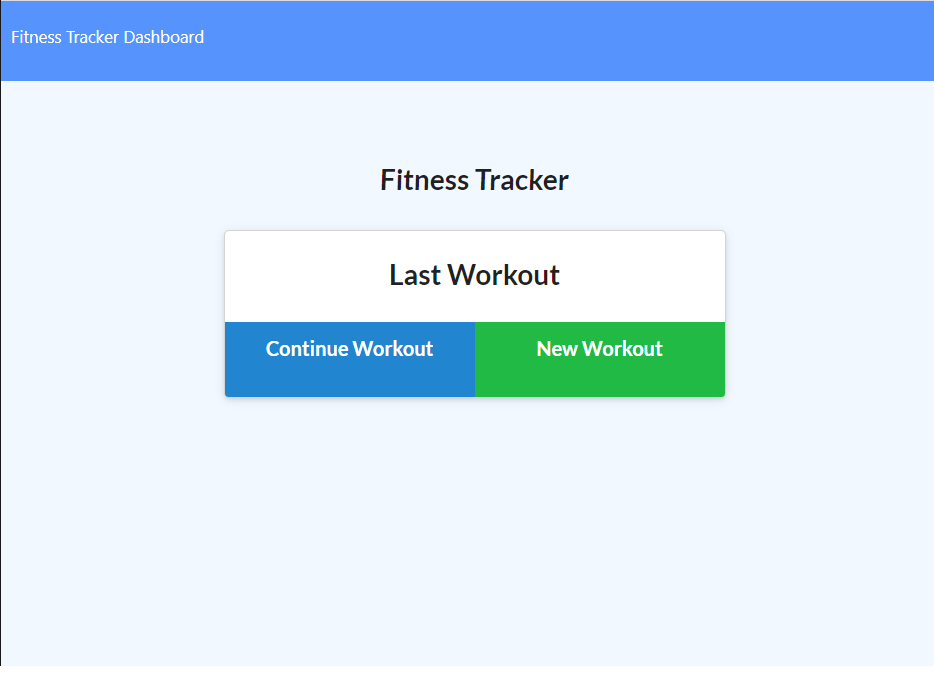

# Workout Tracker

## Description
With this app, users can input what exercise they will be doing, how many reps and sets for each exercise, and how much weights they will be using for that exercise. Users can also input any cardio exercises that they choose to do as well. With the cardio exercises, users will need to put down how far they have gone, or will go in miles.

